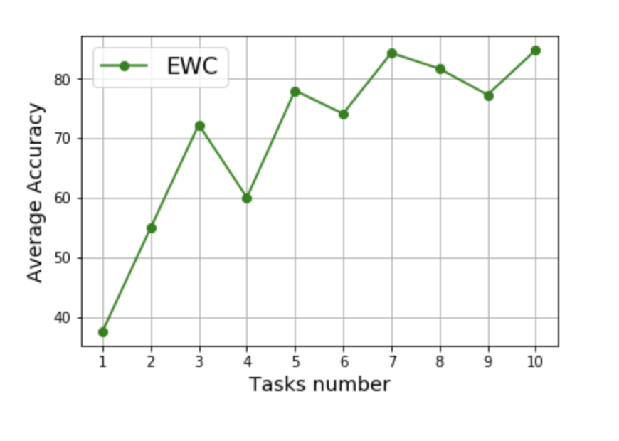
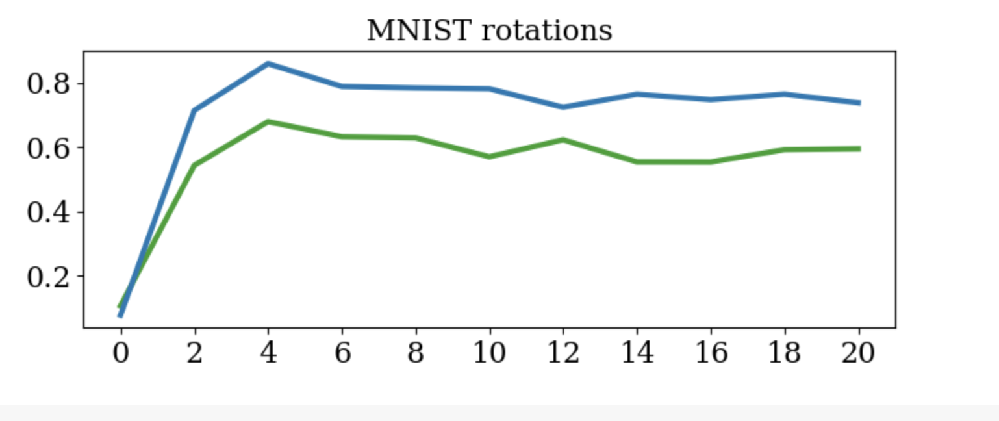
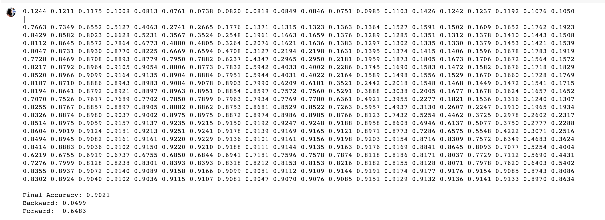
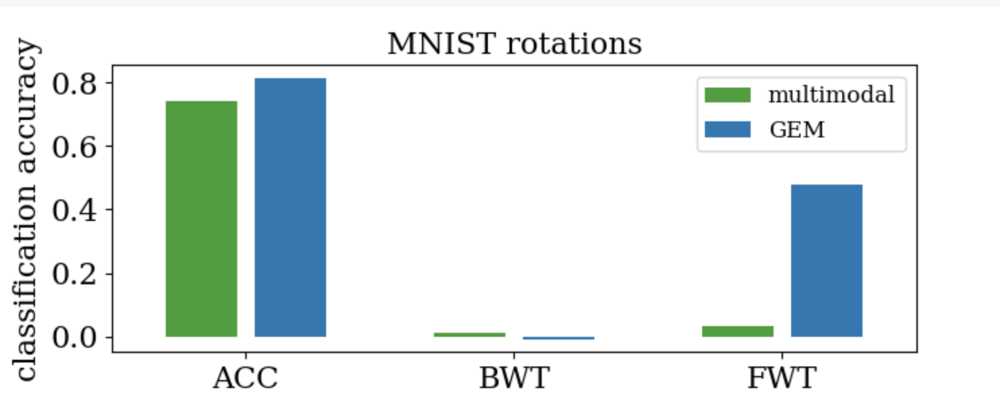

# Rotated_MNIST_Continual_Learning
Continual learning strategies(EWC, GEM) for rotated MNIST dataset

### Group Memeber: 
Ruinan Zhang rz1109@nyu.edu
Manlan Li ml6589@nyu.edu

### Project Description 

In this projct, our group exlpored the rotated MNIST dataset with two continual learning strategies:

-  (1) Elastic Weights Consolidation (EWC) Strategy (code can be found both in repo or [here](https://www.kaggle.com/ruinanzhang44/project-2-rotated-mnist?scriptVersionId=31495772))

- (2) Gradient Episodic Memory (GEM) (code can be found both in repo or [here](https://colab.research.google.com/drive/1rgihSIEjvY0EdNOOLzKjcX11uT5olnCQ))

### Dataset
Training Dataset: 60000 * 28 * 28

Test Dataset: 10000 * 28 * 28

Rotation: Randomized rotation 

MNIST VS Rotated MNIST

### Result 

- (1) EWC run on total 10 tasks with final acc 85.78%: 

- (2) GEM run on total 20 tasks with final acc 90.21%

Besides accuracy, there are two additional metrics used to assess the ability of the algorithm to transfer knowledge - Backward transfer (BWT) and Forward transfer (FWT)

BWT: the influence that learning a task t has on the performance on a previous task k ≺ t

FWT: the influence that learning a task t has on the performance on a future task k ≻ t

